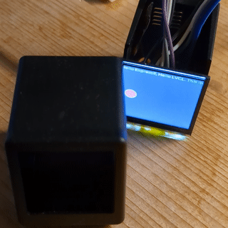

# Archived

Check out https://github.com/jo-m/netshlix instead.

## SmallTv-Pro ESP-IDF Sample Project



Minimal ESP-IDF 5 sample project, demonstrating how to set up and control the 240x240 LCD display of the Smalltv-Pro device.
Starting point to write your own project to run on this cute hardware.

```bash
source $IDF_PATH/export.sh

# Build/flash
idf.py build flash
```

## Links

- Buy on Aliexpress https://www.aliexpress.com/item/1005005699410709.html
- [Thread on home-assistant forum](https://community.home-assistant.io/t/installing-esphome-on-geekmagic-smart-weather-clock-smalltv-pro/618029)
- Github repo with firmware updates (manufacturer): https://github.com/GeekMagicClock/smalltv-pro

## TODO

- [ ] Enable touch button (GPIO 32)
